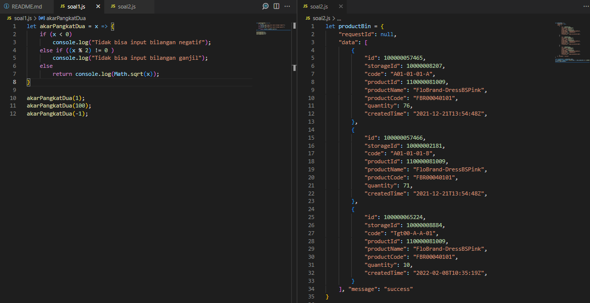
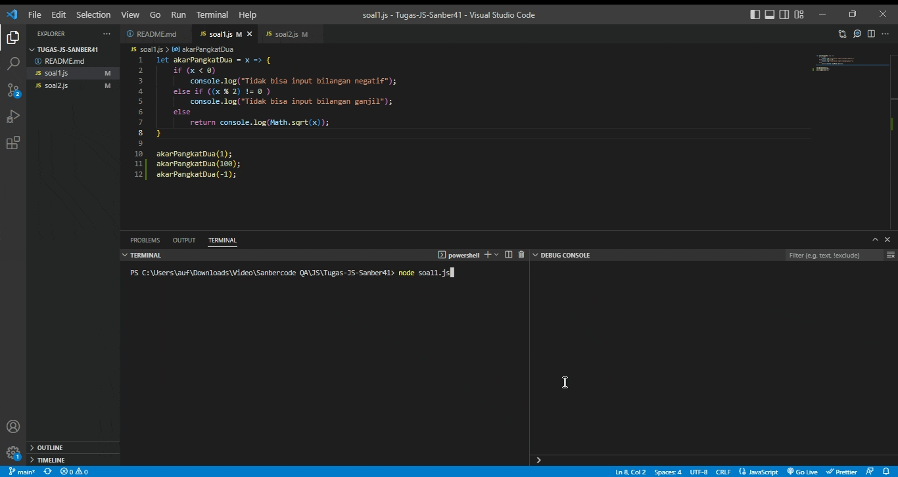
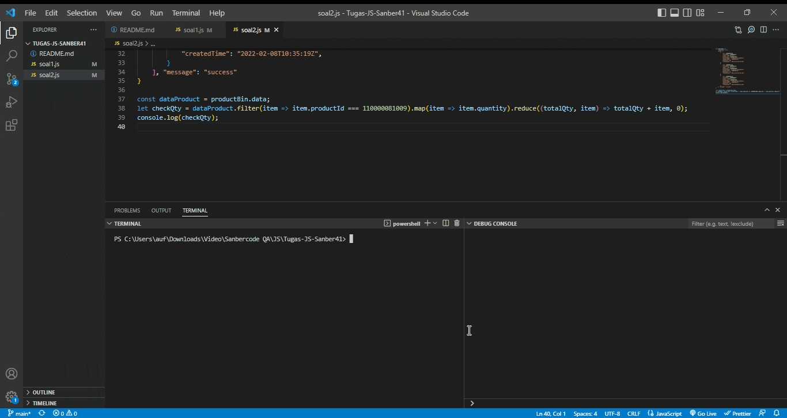

<div id="top"></div>

<!-- PROJECT LOGO -->
<br />
<div align="center">
    

  <p align="center">
    Tugas Javascript Sanbercode 41
    <br />
    <a href="#demo">View Demo</a>
  </p>
</div>

  
<br />
<br />

## Soal 1
Buatlah sebuah program dari akar pangkat 2 dari x dengan x harus bilangan genap, dengan kondisi sebagai berikut :
- Jika user input angka kurang dari 0 , user get error message "Tidak bisa input bilangan negatif" 
- Jika user input angka ganjil, user get error message "Tidak bisa input bilangan ganjil"

Hint : gunakan rumus sqrt(x)
- Code
 `soal1.js`
   ```js
    let akarPangkatDua = x => {
        //cek apakah bilangan negatif
        if (x < 0) 
            console.log("Tidak bisa input bilangan negatif");
        //cek apakah ganjil
        else if ((x % 2) != 0 )
            console.log("Tidak bisa input bilangan ganjil");
        //cek jika genap maka diakar
        else
            return console.log(Math.sqrt(x));
    }
   ```
- Result
  
<br />
<br />

## Soal 2
 Misalkan terdapat response API sebagai berikut. 
 ```js
 let productBin = { 
    "requestId": null, 
    "data": [ 
        { 
            "id": 100000057465, 
            "storageId": 10000008207, 
            "code": "A01-01-01-A", 
            "productId": 110000081009, 
            "productName": "FloBrand-DressBSPink", 
            "productCode": "FBR00040101", 
            "quantity": 76, 
            "createdTime": "2021-12-21T13:54:48Z", 
        }, 
        { 
            "id": 100000057466, 
            "storageId": 10000002181, 
            "code": "A01-01-01-B", 
            "productId": 110000081009, 
            "productName": "FloBrand-DressBSPink", 
            "productCode": "FBR00040101", 
            "quantity": 71, 
            "createdTime": "2021-12-21T13:54:48Z", 
        }, 
        { 
            "id": 100000065224, 
            "storageId": 10000008884, 
            "code": "Tgt00-A-A-01", 
            "productId": 110000081009, 
            "productName": "FloBrand-DressBSPink", 
            "productCode": "FBR00040101", 
            "quantity": 10, 
            "createdTime": "2022-02-08T10:35:19Z", 
        } 
    ], "message": "success" 
}
 ```
Sebagai QA Engineer kalian ingin mengecek total quantity  dari bebarapa storageId untuk productCode FBR00040101 (FloBrand-DressBSPink). Buatlah sebuah program javascript untuk menjumlahkan quantity dari semua storageId untuk produk tersebut 
 
Hint : Gunakan metode Pengulangan, Array dan Object keys (silakan cari referensi cara mendapatkan value dari json)
- Code
 `soal2.js`
   ```js
    //tampung array data
    const dataProduct = productBin.data;
    // fungsi cek total qty
    let checkQty = dataProduct
        // filter item dengan id 110000081009
        .filter(item => item.productId === 110000081009)
        // map item qty
        .map(item => item.quantity)
        // reduce total value dari item qty
        .reduce((totalQty, item) => totalQty + item, 0);
    console.log(checkQty);
   ``` 
- Result
  
<br />
<p align="right">(<a href="#top">back to top</a>)</p>

